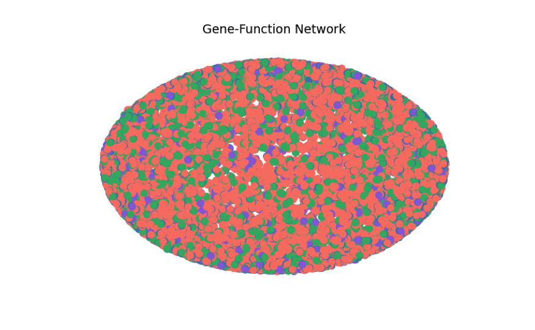
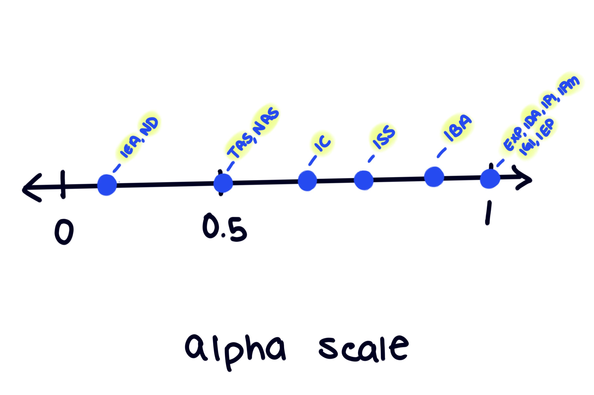

# Categorical Groups and Centrality in Gene Ontology Data

::: {.callout-note appearance="minimal" icon="false"}
For your first project, you are asked to:

1.  Identify and load a network dataset that has some categorical information
    available for each node.

2.  For each of the nodes in the dataset, calculate degree centrality and
    eigenvector centrality.

3.  Compare your centrality measures across your categorical groups.
:::

### Data Load

```{python}
import networkx as nx
import matplotlib.pyplot as plt
import pandas as pd
import numpy as np
from scipy import stats
```

In this first project, I will use SNAP data titled [Gene Function Association
Network](https://snap.stanford.edu/biodata/datasets/10024/10024-GF-Miner.html)[
](https://snap.stanford.edu/data/memetracker9.html). The dataset contains an
association network of over 22k nodes and over 16k edges for gene function. The
edges are meant describe what a gene does.

```{python}
genes=pd.read_csv("GF-Miner_miner-gene-function.tsv", sep= "\t")
genes.head()
```

As much as I enjoy hearing about molecular world, I'm nonetheless unfamiliar
with its many intricacies; particularly in the field of Genomics. The variables
in the dataset are labeled alphanumerically. This format does't explain or hint
at the meaning of the observations, so it's not accessible for those unfamiliar
with the subject matter. I'll need to research the datapoints in order to
understand the variables as there is also no data dictionary. All of the columns
will require renaming for clarity.

Before I begin researching, let's check out how many groups and NA values in
each column:

```{python}
#-- organizing overview--
overview= (
  genes
  .agg(["nunique", lambda x: x.isna().sum()])
  .T
)
#-- renaming summary columns for clarity--
#-- and the index because I prefer it this way--
overview=overview.reset_index()
overview.columns=["variable", "unique", "NA count"]
overview
```

There are several columns with many NA; `C3`, `C7`, `C10`, `C15`, `C16` are all
flagged. In the interest of time, I will likely impute NA values, but I *do*
want to acknowledge the context of the NA values first. There are several
columns I'm sure I wont need, so I will remove them now.

My main focus here is *human* data. Although the column has no missing values,
all datapoints in `C12` *include* humans, so I am sure it will not be needed. I
won't need the PubMed identifiers in `C13`, and I won't need the Ontology
Resource Names in `C14`.

```{python}
#-- removing column not needed--
genes= genes.drop(columns=["C12"])
genes= genes.drop(columns=["C13"])
genes= genes.drop(columns=["C14"])
```

### Creating a Data Dictionary

::: {.callout-note appearance="minimal" icon="false"}
-   `GO_ID` : A standardized gene ontology framework of unique identifier used
    in biology [^1]
-   `C0`: Database
-   `C1`: Gene ID- Genes receive a unique ID for database records. I'll save
    this column for labeling. The ID mappings can be retrieved using
    <https://www.uniprot.org/id-mapping>
-   `Gene` : Named Genes
-   `C3` : Action upon Gene (Colocation, Contribution. . .)
-   `C5`: Reference
-   `C6`: Evidence code- Note on function of a gene 13 unique values:\
    <https://geneontology.org/docs/guide-go-evidence-codes/>\
    experimental evidence, phylogenetic evidence (inferred through experimental
    evidence), computational evidence, author statements (statements made by
    authors in scientific papers), curatorial statements (an expert from a
    database), automatically generated annotations (automated, no person
    reviewed this)\
    \
    maybe i can add alpha values to depict how credible the gene assignments
    are?
-   `C7`: external reference
-   `C8`: Aspect/Category_type- Process, Function, Component (secondary nodes?)
    type of role gene plays
-   `C9`: Encoder_name
-   `C10` : Encoder
-   `C11` : Function type
-   `C12` : Taxonomy. All datapoints include "8606" which is homosapien
-   `C13` : PMID- not needed
-   `C14`: Ontology Resources- not needed
-   `C15`: Action upon entity (entity can be searched)
-   `C16` : Database reference
:::

[^1]: <https://geneontology.org/docs/ontology-documentation/>

To create this dictionary I have sampled random datapoint within each column and
researched them until I found consensus. For example, `C8` is a category/type. I
searched "Gene Ontology F, C, P" and found [Go Enrichment Analysis
Tools](https://geneontology.org/docs/go-enrichment-analysis/). The site
describes how the gene ontology tool is used and they explain that a "GO Aspect"
may be selected and these are "molecular **function**", "cellular
**component**", and "biological **process**". I went back and searched up the
corresponding IDs for my randomly chosen rows to confirm their listed "Aspect"
matched their line in `C8`. I renamed the column as `category_type` instead of
`aspect` because I just preferred it.\


Now, let's modify the column names to be slightly more descriptive:

```{python}
genes.columns=["go_id", "database", "gene_id", "gene_name", "action", "ref", "evidence_code", "ex_ref", "category_type", "encode_name", "encoder", "func_type", "action_on_entity", "db_ref"]
genes.head()
```

Now our NA overview will be more readable:

```{python}
overview= (
  genes
  .agg(["nunique", lambda x: x.isna().sum()])
  .T)


overview=overview.reset_index()
overview.columns=["variable", "unique", "NA count"]
overview
```

### Creating a Graph

The data does specify that the edges are the functional annotations and nodes
are the `go_id` and `gene_name`. In this project however we'll use
`category_type` and `database` as our categorical groups because each variable
is perfect with only 3 distinct values.

[I think `category_type` will have interesting centrality within its groups.
Biological Process will presumably have many connections. Molecular functions
should be second best. Cellular Component would presumably . and]{.underline}

This graph will be undirected because we're exploring mutual connection. Action
had far to many NA values (which could very well mean there is no action to be
had). Well, I might as well check out the denomination of that, while we're on
the topic.

```{python}
#--grabbing the points needed--
na_actions= genes[genes["action"].isna()]
cat_total= genes.groupby(["category_type"]).size().reset_index(name="count")
na_counts= na_actions.groupby(["category_type"]).size().reset_index(name="na_count")

#--neat df--
summary_denom= pd.merge(na_counts, cat_total, on="category_type")
summary_denom["na_percent"]= (summary_denom["na_count"]/summary_denom["count"]*100).round(2)

summary_denom
```

There doesn't seem to be much difference in the categories, in terms of the NA
values within the `action` column. Over 90% of values are NA, but judging by the
sheer volume and attention to detail of Genomic data– its very likely there is
no immediate action from the genes marked as such. I thought to keep the
`action` column and use an "if" function to display action when available,
however, this `action` column would classify as directional. The rest of my data
is best in an undirected graph depicting relationships. For the sake of
simplicity and time, I will choose to drop the `action` column.

```{python}
genes= genes.drop(columns=["action", "ex_ref", "action_on_entity", "db_ref", "encoder"])
```

```{python}
gg1= nx.Graph()
```

I ran a preliminary graph and as its pictured below, it is far to dense to be
readable. I will take a stratified sample of my data to maintain the original
balance of the categorical values in `genes`.

{fig-align="center" width="564"}

```{python}
#--stratified sample--
sample= genes.groupby("category_type", group_keys=False).sample(frac= 0.05)

gg1.add_edges_from(sample[["gene_name", "evidence_code"]].values)
gg1.add_edges_from(sample[["evidence_code", "go_id"]].values)
gg1.add_edges_from(sample[["go_id", "category_type"]].values)
```

Now that the data is ready for visualization. I want to solidify what it is I
want to see in the graph. The vantage point I'm looking to take will include a
variable I elaborated most on in the data dictionary I created earlier.
`evidence_codes` are notes on the function of a gene. There are 26 unique codes
in existence under 6 categories. The gene data i am using only has 13 unique
codes after NA removal.

##### Whats important about this?

The evidence codes can be depicted by alpha levels because there is a
credibility hierarchy to them. "Non-traceable author statements" have less
credibility than functions indicated from an actual experiment. So the shade of
our graph will be linked to how

::: {.callout-important appearance="minimal" icon="false"}
**"Do certain GO aspects (category types) tend to rely on particular evidence
types, and which genes appear within those pathways?"**
:::

As much as visualization is worth, values are sometimes easier to understand.
I'll map the code acronyms for clarity.

###### Intermission: Values and Regular Plot

```{python}
ec_names= {"IEA": "Inferred from Electronic Annotation",
"IDA": "Inferred from Direct Assay",
"ISS": "Inferred from Sequence or Structural Similarity",
"IMP": "Inferred from Mutant Phenotype",
"IPI": "Inferred from Physical Interaction",
"TAS": "Traceable Author Statement",
"ND": "No biological Data available",
"IBA": "Inferred from Biological aspect of Ancestor",
"IEP": "Inferred from Expression Pattern",
"EXP": "Inferred from Experiment",
"NAS": "Non-traceable Author Statement",
"IGI": "Inferred from Genetic Interaction",
"IC": "Inferred by Curator"}

cta_types= {"P": "Process","F": "Function", "C": "Component"}
```

```{python}
#-- Mapping Evidence Names--
genes["evidence_names"]= genes["evidence_code"].map(ec_names)

#-- Mapping Aspect/ Category Types--
genes["aspect"]= genes["category_type"].map(cta_types)
```

Below is a table of evidence codes and how they're distributed within each
category:

```{python}
cred_count= genes.groupby(["aspect", "evidence_names"]).size().reset_index(name="count").sort_values(["aspect", "count"], ascending= [True,False])
```

A visual for thoroughness:

```{python}

#--Pivotting because of the long labels--
piv_cred_count= cred_count.pivot(index="evidence_names", columns="aspect", values="count").fillna(0)

piv_cred_count= piv_cred_count[["Process", "Function", "Component"]]
piv_cred_count= piv_cred_count.sort_values(by="Process", ascending=False)

ax= piv_cred_count.plot(kind="barh",figsize=(12,7),
color= ["hotpink", "dodgerblue", "olivedrab"])
ax.set_xlabel("Count")
ax.set_ylabel("")
ax.set_title("Evidence Code Frequency by Category Type")
ax.legend(title= "Category Type")

plt.tight_layout()
plt.show()
```

###### Credibility

I'm scoring the evidence types as follows:\
{width="582"}

Those under experimental evidence will be graded as 1 such as `EXP`, `IDA`,
`IPI`, `IPM` , `IGI`, and `IEP` .The lowest value should still be visible so 0.2
will be assigned to `IEA` and `ND`.

```{python}
alpha_map= {"IEA": 0.2,"ND": 0.2,"TAS": 0.5,"NAS": 0.5,"IC": 0.6,"ISS": 0.7,"IBA": 0.8,"EXP": 1.0,"IDA": 1.0,"IPI": 1.0, "IGI": 1.0,"IMP": 1.0,"IEP": 1.0}
```

## Centrality of Nodes in a Graph

Even in my sample there are a lot of datapoints which will lead to another
unreadable network clump. Centrality and eigenvector centrality will help
identify which nodes are the most connected and which of those matter.

```{python}
centrality= nx.degree_centrality(gg1)
eig_centrality= nx.eigenvector_centrality(gg1, max_iter=2000)

#-- creating new columns for centrality-- 
gene_centrality= (sample[["gene_name"]].drop_duplicates())

gene_centrality["degree_centrality"]= gene_centrality["gene_name"].map(centrality)
gene_centrality["eig_centrality"]= gene_centrality["gene_name"].map(eig_centrality)

#-- isolating top genes--
top_genes= gene_centrality.sort_values("eig_centrality",ascending=False).head(5)
```

```{python}
top_sample= sample[sample["gene_name"].isin(top_genes["gene_name"])]
```

###### The Graph

```{python}
#-- edges--
gg1.add_edges_from(top_sample[["gene_name", "evidence_code"]].values)
gg1.add_edges_from(top_sample[["evidence_code", "go_id"]].values)
gg1.add_edges_from(top_sample[["go_id", "category_type"]].values)

#--node gruops--
gene_nodes= set(top_sample["gene_name"])
evidence_nodes= set(top_sample["evidence_code"])
go_nodes= set(top_sample["go_id"])
category_nodes= set(top_sample["category_type"])
```

```{python}
#-- assigning my customizations--
category_color_map= {"P": "skyblue", "F": "skyblue", "C": "skyblue"}
gene_color= "mediumpurple"
go_color= "gold"
evidence_code_color= "darkgray"

#-- selecting colors--
node_colors = []

for node in gg1.nodes():
  if node in category_nodes:
    node_colors.append(category_color_map[node])
  elif node in gene_nodes:
    node_colors.append(gene_color)
  elif node in evidence_nodes:
    node_colors.append(evidence_code_color)
  elif node in go_nodes:
    node_colors.append(go_color)
  else:
    node_colors.append("lightgray")
        
pos= nx.spring_layout(gg1, seed=30)
```

I'll assign a scaling function over the nodes in my graph. In testing I find
that despite sampling there is still too many nodes and edges in the graph to
make it readable. Adding a visual priority to nodes that have the highest eigen
values/ are most important and connected to other important nodes.

```{python}
#--scaling eig values to reflect on node size--
base_node_size=50
scale= 1000
node_sizes= [base_node_size+ eig_centrality[node] * scale for node in gg1.nodes()]
```

```{python}
#-- drawing the graph--
plt.figure(figsize=(35,30), dpi=300)

nx.draw_networkx_edges(gg1, pos, alpha=0.25, width=.5)
nx.draw_networkx_nodes(gg1, pos, node_color= node_colors, node_size=node_sizes)
nx.draw_networkx_nodes(gg1, pos, )

nx.draw_networkx_labels(gg1, pos, font_size=9)

plt.title("Gene Ontology Annotation Network: Relationships Between GO Aspects, Evidence Codes, and Associated Genes")
plt.axis("off")
plt.show()
```

### Comparing Centrality Across Categorical Groups

The categories assigned to the genes describe what the particular gene
participates in. As we've seen, genes in this dataset predominantly participate
in biological processes. And less so in

```{python}
#--creating summary of centrality by nodes--
centrality_summary= pd.DataFrame({
  "node": list(centrality.keys()),
  "deg_centr": list(centrality.values()),
  "eig_centr": list(eig_centrality.values())})
  
#-- attaching the categories--
cats= genes[["go_id", "category_type"]].drop_duplicates()
cats.columns= ["node", "category_type"]

#--putting them together--
centrality_summary= centrality_summary.merge(cats, on="node", how= "left")

#--labeling genes just in case--
centrality_summary["category_type"]= centrality_summary["category_type"].fillna("gene")
```

```{python}
centrality_summary.groupby("category_type")[["deg_centr", "eig_centr"]].describe()
```

```{python}

fig, axes= plt.subplots(1, 2, figsize= (11, 4))

for ax, col, label in zip(axes, ["deg_centr", "eig_centr"], ["Degree Centrality", "Eigenvector Centrality"]):
  groups= [group[col].values for x, group in centrality_summary.groupby("category_type")]
  labels= centrality_summary["category_type"].unique()
  ax.boxplot(groups, labels=labels)
  ax.set_title(label)
  ax.set_ylabel("Score")
  ax.set_xlabel("GO Aspect / Node Type") 

plt.tight_layout()
plt.show()
```

### Statistical Tests on Categorical Data

(Kruskal Wallas)

### Centrality by Credibility

```{python}

for x, row in genes.iterrows():
  gene_node= row["gene_name"]
  go_node= row["go_id"]
  evidence_node= row["evidence_code"]
  alpha_values= alpha_map.get(evidence_node, 0.5)
  
  gg1.add_node(gene_node, node_type="gene")
  gg1.add_node(go_node, node_type="gene")
  gg1.add_edge(gene_node, go_node, alpha=alpha_values, evidence_code= evidence_node)
```

##### Confidence Graph

##### recomputing centrality

##### comparison to full graph results

--------------------------------------------------------------------------------

# References

Matplotlib List of Named colors:\
<https://matplotlib.org/stable/gallery/color/named_colors.html>
